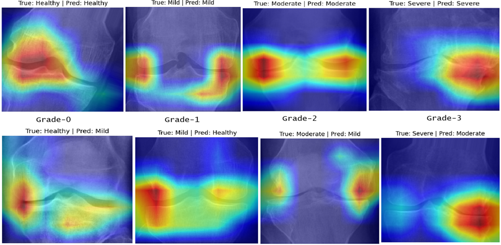

# 🦴 Knee Osteoarthritis Severity Classification using Deep Learning & Vision Transformers

---

## 📌 Overview

This project focuses on **automated classification of Knee Osteoarthritis (KOA) severity** using advanced deep learning techniques.
We integrate **CNN architectures** and **Vision Transformers (ViT)** to capture both **local features** and **global relationships** in X-ray images.

---

## 🧠 Models Used

### 🔹 Convolutional Neural Networks (CNNs)

* Xception
* DenseNet169
* EfficientNetV2B3
* ResNet

👉 These models extract **local spatial features** such as:

* Edges
* Textures
* Joint structure patterns

---

### 🔹 Vision Transformer (ViT)

* Uses **Multi-Head Self-Attention Mechanism**
* Captures **global relationships between different regions of the image**
* Helps understand **long-range dependencies in knee joint structure**

---

## 📂 Dataset

* https://www.kaggle.com/datasets/shashwatwork/knee-osteoarthritis-dataset-with-severity
* https://data.mendeley.com/datasets/56rmx5bjcr/1

👉 These datasets contain labeled X-ray images for **KOA severity grading (Grade 0–3)**

---

## ⚙️ Methodology (Step-by-Step)

### 1️⃣ Data Collection

* Combined datasets to increase diversity
* Ensured balanced class distribution

---

### 2️⃣ Data Preprocessing

#### 🔹 Noise Removal

* Removed artifacts, blur, and distortions

#### 🔹 Image Enhancement

* Improved visibility of joint regions

#### 🔹 Resizing

* Standardized to **224 × 224 pixels**

---

### 3️⃣ Data Augmentation

Applied carefully without disturbing clinical features:

* Rotation
* Horizontal flipping
* Scaling
* Shearing
* Resizing (224×224)
* CLAHE:

  * Clip Limit: 5.0
  * Tile Grid Size: (8, 8)

👉 Enhances contrast while preserving medical relevance

---

### 4️⃣ Dataset Preparation

* Augmented + original data combined
* Created new dataset

---

### 5️⃣ Train-Test Split

* Separate training and testing sets
* Ensures unbiased evaluation

---

### 6️⃣ Normalization & Standardization

* **Normalization (0–1 scaling)**
  → Faster convergence

* **Standardization (mean=0, std=1)**
  → Stable training and improved performance

---

## 🏋️ Model Training

### 🔹 CNN Models

* Activation Function: **ReLU**
* Optimizer: **Adam**
* Loss Function: **Categorical CrossEntropy**
* Regularization: Applied (to reduce overfitting)
* Batch Normalization: Used for stable training

🎯 Objective:

* Improve accuracy
* Reduce False Positives & False Negatives

---

### 🔹 Vision Transformer (ViT)

* Activation Function: **GeLU**
* Optimizer: **AdamW**
* Uses attention-based learning for global context

---

### 🔹 Transfer Learning & Fine-Tuning

* Pre-trained weights used (ImageNet)
* Fine-tuned hyperparameters:

  * Learning rate
  * Batch size
  * Epochs

---

## 📊 Model Evaluation

* 📈 Accuracy & Loss Curves
* 📊 Confusion Matrix
* 📉 ROC Curve

👉 Helps evaluate:

* Performance
* Error distribution
* Model reliability

---

## 🔥 Model Explainability (Grad-CAM++)

### 📌 Sample Predictions



👉 Shows model focus regions for:

* Healthy
* Mild
* Moderate
* Severe

---

### 📌 Grad-CAM++ (Extension of Grad-CAM)

* Uses **positive gradients** and **pixel-wise weighting (α)**
* Incorporates **higher-order gradients** for better accuracy

#### 🔹 Weight Calculation:

```
w_k^c = Σ_i Σ_j α_kc^ij · ReLU( ∂y / ∂A_ij^k )
```

#### 🔹 Saliency Map:

```
L_ij^c = ReLU( Σ_k w_k^c A_ij^k )
```

---

### 📌 Key Benefits

* Produces **class-specific saliency maps**
* Highlights **important joint regions**
* Improves **model interpretability in medical diagnosis**

👉 Helps understand:

* Why the model predicted a class
* Which regions influenced the decision

---

## 📊 Results

* High classification performance across models
* ViT improved **global understanding**
* Grad-CAM++ validated focus on **clinically relevant regions**

---

## 🚀 Key Contributions

* Hybrid use of CNN + Transformer models
* Robust preprocessing & augmentation pipeline
* Improved classification accuracy
* Explainable AI using Grad-CAM++

---

## 📌 Future Work

* Use larger datasets
* Deploy as clinical support system
* Explore hybrid CNN-Transformer architectures

---

## 👨‍💻 Author

Rohan

